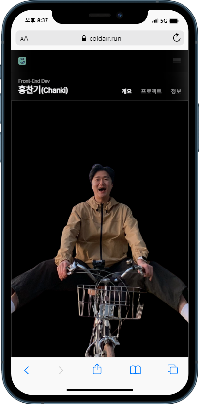

 

 
<!-- Index -->

**Index**

<ul>
    <li><a href="#overview">Overview</a></li>
    <li><a href="#introduction">Introduction</a></li>
    <li><a href="#configuration">Configuration</a></li>
    <li><a href="#roadmap">Roadmap</a></li>
    <li><a href="#stacks">Stacks</a></li>
   <li><a href="#browser-support">Browser Support</a></li>
   <li><a href="#members">Members</a></li>
</ul>

---

# Overview

- **프로젝트명**: 홍찬기 포트폴리오

- **기간**: 2023.05.28. ~

- **목표**: 개발 포트폴리오입니다. 이 사이트에서는 기술적 역량과 다양한 프로젝트를 확인할 수 있습니다.

- **배포주소**: https://coldair.run/

# Introduction

이 사이트에서는 프론트앤드 개발을 중심으로, Vanilla JS부터 최근에는 React (TS)를 사용하여 개발하고 있음을 보여드립니다. 프론트앤드에 대해 공부한 과정과 다양한 문제 해결 과정을 기술블로그(벨로그)와 원격저장소(깃허브) 링크를 통해 확인할 수 있도록 제공합니다.
이 사이트를 통해 기술적 역량과 제가 수행한 다양한 프로젝트를 확인할 수 있습니다.

각 프로젝트 섹션에서 해당 프로젝트의 목표, 개요, 사용된 기술 및 도구, 결과물에 대한 설명을 제공합니다. 또한, 프로젝트에 대한 스크린샷, 개발과정의 세부 내용을 볼 수 있는 기술블로그(벨로그), 원격저장소(깃허브), 실제 서비스 링크 등을 포함해 근거를 제공합니다.

또한, 이 사이트는 반응형 웹 디자인을 통해 다양한 디바이스와 화면 크기에서 최적의 사용자 경험을 제공합니다. 데스크톱, 태블릿, 스마트폰 등 다양한 환경에서 편리하게 이용할 수 있습니다.

이 사이트는 인터렉티브 웹을 통해 사용자와의 상호작용을 강조합니다. 웹 페이지의 요소들과 실시간으로 상호작용할 수 있으며, 사용자의 입력 또는 동작에 따라 웹 페이지가 동적으로 변화하고 다양한 효과와 애니메이션을 보여줍니다. 인터렉티브 웹을 구현하기 위해 다양한 기술과 기법을 사용합니다.

마지막으로, 협업, 질문 또는 제안이 있으신 경우 카카오톡(오픈링크)과 메일을 통해 연락할 수 있도록 링크을 제공합니다.

# Configuration

|  |  |
| :------------------------------------------------------------: | :---------------------------------------------------------------: |
|                         더존(강촌)메인                         |                          더존(을지)메인                           |

|  |  |  |
| :------------------------------------------------------------: | :--------------------------------------------------------------: | :-----------------------------------------------------------: |
|                         더존(강촌)버스                         |                          더존(강촌)버스                          |                        더존(강촌)버스                         |

# Roadmap

- [x] Cross-browsing을 위한 CSS reset (styled-reset)
- [x] Router (react-router-dom)
- [x] 카카오톡 플러스친구에서 링크 제공을 위한 URL 파라미터 (react-router-dom)
- [x] 최근 옵션(회사, 버스종착지) 저장 (local storage)
- [x] 대시보드(Home)의 날씨와 미세먼지 Api 연결 (Open Api)
- [x] 버스(Bus)에서 사용자 현재위치 정보 가져오기 (Web Api)
- [x] 버스(Bus)의 현재위치와 각종 정류장 위치정보 맵에 표시 (Kakao Api)
- [x] 버스(Bus)의 현재위치로 부터 남은시간 받는 Api 연결 (Back-end)
- [x] Api Key env 저장
- [x] 404Ppage
- [x] SEO(Search Engine Optimization) 설정
- [x] CI/CD (GitHub Actions, Firebase)
- [x] PWA(Progressive Web App) 설정
- [x] 식단(Meal)의 일주일 날짜 표시 및 현재 날짜 및 식단 자동 선택 로직
- [ ] PWA 개선
- [ ] 카페, 빵돌이오마카세 페이지
- [ ] PC 환경 지원

# Stacks

- **Environment**:    

- **Developement**:
  - **FRONT-END**:   

# Browser Support

  

# Members

- **HONG**

  - **GitHub**: https://github.com/coldair426
  - **Blog**: https://velog.io/@coldair426
  - **Mail**: coldair426@gmail.com

---

**Full README가 보고 싶다면 [velog](--)를 참고하세요.**
